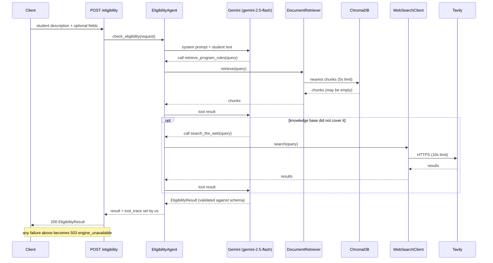

# 05 - Productionize the Agentic RAG flow

## What

This feature is the brain of ScholarLens. Before it, `POST /eligibility` did
the validation and then returned a deliberate `503`, because nothing existed to
answer. After it, the endpoint hands the student's description to an AI agent
that:

1. searches a knowledge base of program rules (ChromaDB),
2. searches the web (Tavily) only if the knowledge base does not cover the
   question,
3. returns a structured, cited `EligibilityResult`: a verdict, a plain-language
   explanation, the exact quoted clause, the source, anything it still needs to
   know, and a short list of activity steps.

The words "productionize" in the title matter. The capstone this project grew
from already had an agent. The work here was making it survivable: every
outside service sits behind a small wrapper with a timeout, and every way it can
fail ends in the same controlled `503 engine_unavailable` response instead of a
crash or a hang.

## Why

The product promise is "we tell you what you qualify for and quote the rule
behind it". Feature 4 built the front door and the response shape; something had
to answer. But the interesting part is *how*, and why not something simpler:

- **A plain keyword search** would miss matches ("household income" vs "family
  earnings") and cannot combine rules ("GPA over 3.0 AND New Jersey resident").
- **Asking a language model directly** works until it does not: it will produce a
  confident, wrong, uncited answer about a real student's money. For this product
  a fabricated "you are eligible" is worse than no answer.
- **Retrieval first, then answer** (RAG) grounds the model in real text. The
  agent part lets it decide *per question* whether the knowledge base is enough
  or whether it needs the live web (a rule may have changed this year).

And the "production" part has a concrete cost if skipped. Three outside services
(a language model, a vector database, a search API) can each be slow, down, or
misconfigured. Without timeouts and one error shape, a slow provider holds a web
request open for minutes, and the frontend (feature 10) cannot tell a real
"no" from "the server broke".

## Key concepts

**A language model (LLM)** is a program trained to continue text. Given a
prompt it produces a plausible reply. It does not look anything up; it
remembers patterns, and can state falsehoods fluently.

**An agent** is an LLM placed inside a loop where it can *choose actions*, see
the results, and decide what to do next, until it can answer. Analogy: instead of
answering an exam from memory, the student may walk to the library, look
something up, come back and think again. The loop is the part that makes it an
agent rather than a chatbot.

**ReAct** (Reason + Act) is the name for that loop: the model reasons about
what it needs, acts by calling a tool, observes the result, and repeats. Here
that reads: "I need the Cal Grant GPA rule -> call the knowledge-base tool ->
read the returned chunks -> answer."

**A tool** (tool calling / function calling) is an ordinary function the model
is allowed to ask the program to run. The model does not run code; it emits "call
`retrieve_program_rules` with query X", the framework runs it and feeds the
result back. The function's docstring is what tells the model what the tool is
for, so it doubles as prompt text.

**Structured output** means forcing the model's final answer into a schema
instead of free text. Here the schema is `EligibilityResult`. The framework
validates what the model returns against it; anything malformed is rejected and
retried. This is what lets the frontend rely on `status` being exactly one of
`eligible`, `partial`, `not_eligible`.

**Pydantic AI** is the library that provides all of the above: the `Agent`
object, `@agent.tool`, structured output validated by Pydantic (the same
library FastAPI uses for request validation, so the whole app shares one way of
describing data).

**A system prompt** is standing instructions given to the model on every run,
separate from the user's question. Ours is short and rule-like: check the
knowledge base first, use the web only if it does not cover the question, never
say `eligible` or `partial` without a quoted clause and a source, and list
missing student facts in `missing_info` instead of guessing.

**RAG in one sentence:** retrieve relevant text, put it in front of the model,
and make it answer from that text. **Agentic** RAG adds that the model chooses
whether and what to retrieve.

**A thin client** is a small wrapper class around one outside service that does
one job and exposes one method (`retrieve`, `search`). Everything ugly (URLs,
retries, error types) stays inside it. The rest of the code sees a clean call and
one typed exception.

**Typed exceptions and "degrade, do not crash".** Instead of letting a random
`ConnectionError` or `KeyError` escape, each client converts every failure into
one exception of its own (`RetrievalUnavailableError`,
`WebSearchUnavailableError`); the agent wraps those into one more
(`EligibilityEngineError`); the route turns that into HTTP `503`. Each layer
speaks one language, so the layer above needs one `except`.

**A timeout, and why there are four.** A timeout is a deadline after which a
program stops waiting. Each layer needs its own because they protect different
things: the model's HTTP call (20s), ChromaDB (5s), Tavily (10s), and the whole
agent run (45s). The last matters because the first three limit a *single
request*, not the *total*: a provider that is slow but succeeding could keep one
run looping through many model turns for minutes.

**Dependency injection (`deps`, `RunContext`).** Tools need shared things (the
retriever, the search client). Rather than global variables, Pydantic AI passes a
small `_Deps` object into each tool call. It also carries the request's
`trace` list, so two simultaneous users never share state.

**The tool trace** is the list of user-facing activity labels ("searching
program rules", "checking official sources", ...). It is written by *our code*
when a tool runs, never by the model. That is deliberate: the UI (feature 11)
shows steps, never the model's hidden reasoning, and the model cannot leak its
own chain of thought through this field.

**Lazy construction and `lru_cache`.** `get_agent()` builds the agent the
first time it is needed and then reuses it. Building on first request (not at
import) means the app can start without keys, but it also means a construction
failure happens *during a request*, which is why it needed its own error
handling (below).

## Architecture



Failure flow, which is the point of "productionize":

```
Chroma down / slow   -> RetrievalUnavailableError  --\
Tavily down / no key -> WebSearchUnavailableError  ---+-> EligibilityEngineError -> HTTP 503
Gemini error / slow  -> (any Exception)            ---+   (engine_unavailable envelope)
whole run > 45s      -> TimeoutError               --/
key missing at build -> (any Exception)            --/
```

## What we actually built

**[agent/agent.py](../backend/app/agent/agent.py)** is the centre. `_build_agent`
creates the Pydantic AI `Agent` with the Gemini model, `output_type=EligibilityResult`,
and the system prompt, then registers two tools:

```python
@agent.tool
async def retrieve_program_rules(ctx: RunContext[_Deps], query: str) -> list[dict]:
    """Search the ScholarLens knowledge base for program rules matching `query`."""
    if SEARCHING_PROGRAM_RULES not in ctx.deps.trace:
        ctx.deps.trace.append(SEARCHING_PROGRAM_RULES)
    chunks = await ctx.deps.retriever.retrieve(query)
    return [chunk.model_dump() for chunk in chunks]
```

`EligibilityAgent.check_eligibility` runs the agent under
`asyncio.wait_for(..., timeout=agent_run_timeout_seconds)`, converts every
failure to `EligibilityEngineError`, and after the run overwrites the model's
`tool_trace` with ours plus the two closing labels `"validating eligibility"` and
`"preparing cited answer"`. The four labels are a closed set, a contract with
feature 11.

**[retrieval/client.py](../backend/app/retrieval/client.py)** has
`DocumentRetriever`. It connects to ChromaDB with `HttpClient`, opens the
collection with Gemini's embedding function (so questions are embedded in the
same space as the documents), and `retrieve(query)` returns up to `retrieval_top_k`
`RetrievedChunk`s carrying `text`, `program`, `document`, `url`. An empty
collection returns `[]`; that is a normal state, not an error, because
ingestion did not exist yet (feature 6).

**[tools/web_search.py](../backend/app/tools/web_search.py)** has
`WebSearchClient`, a direct `httpx` call to Tavily's REST endpoint with a 10s
timeout, returning `WebResult`s (`title`, `url`, `snippet`). A missing key, HTTP
error, non-JSON body, or wrong-shaped body all raise `WebSearchUnavailableError`.

**[api/eligibility.py](../backend/app/api/eligibility.py)** lost its placeholder
`503` and now calls the agent, mapping `EligibilityEngineError` to
`HTTPException(503)`. The existing envelope in
[api/errors.py](../backend/app/api/errors.py) is untouched and does the rest.
The route also declares `422` and `503` response models so `/docs` describes the
errors the handlers really emit.

**[config.py](../backend/app/config.py)** gained the settings: `google_api_key`,
`tavily_api_key`, Chroma host/port/collection, `agent_model`, `embedding_model`,
`retrieval_top_k`, and the four timeouts. **[docker-compose.yml](../infra/docker-compose.yml)**
sets `CHROMA_HOST=chromadb`, because inside the Compose network ChromaDB is
reachable by service name, not `localhost`. **[pyproject.toml](../backend/pyproject.toml)**
added the runtime dependencies (`pydantic-ai-slim[google]`, `chromadb`, `httpx`,
`httpx2`).

### Decisions and things that went sideways

- **The provider switch.** The spec was written for OpenAI, per the original
  capstone. Mid-build it turned out there was no OpenAI key but there was a Gemini
  key, so, after explicit confirmation, the whole feature moved to Gemini for both
  reasoning (`gemini-2.5-flash`) and embeddings (`gemini-embedding-001`). The plan
  and overview were updated; some step text in the spec still says OpenAI, so read
  the code, not the prose.
- **Tavily, not SerpAPI.** Confirmed with the user; the abstraction for swapping
  providers was explicitly declined, not deferred.
- **No real timeout on ChromaDB's client.** The spec asked for a timeout on the
  client itself, but `chromadb.HttpClient` (1.5.9) does not accept one. The
  retrieval client instead waits with `asyncio.wait_for` around a worker thread.
  Cancelling that wait does not stop the thread, so against a host that never
  answers, each timed-out request strands one thread. The fix was a small
  dedicated pool of 8 threads so the leak is capped and named instead of draining
  the shared pool. It is a mitigation, not a cure, and the review recorded it as
  accepted residual risk. (Feature 6 later hit the same wall and solved it with
  daemon threads.)
- **A missing key returned 500, not 503.** An independent review (finding F-07,
  the only P1) found that because the agent is built lazily, a missing
  `GOOGLE_API_KEY` raised during the first request and escaped the handler as a
  generic `500 internal_error`. The Compose file marks `.env` as optional, so
  starting the stack without one reaches this path immediately. Fix: wrap agent
  construction so any failure becomes `EligibilityEngineError`.
- **A slow-but-working provider had no ceiling.** The 20s LLM timeout is per HTTP
  call. Pydantic AI's default allows up to 50 model turns per run, so a merely slow
  provider could hold a request for many minutes. The fix was the 45s
  `agent_run_timeout_seconds` around the whole run.
- **Dependency floors that lied.** `pyproject.toml` said `pydantic-ai-slim>=0.0.14`
  and `chromadb>=0.5`, but the code used APIs from 2.44 and 1.5. The declared
  install did not describe a working install. Floors were raised to what was
  actually used, `httpx2` was declared explicitly (swapping to `httpx` triggered
  a deprecation warning), and the beginner `requirements.txt` was updated to match,
  since it would have crashed on import.
- **Small honesty fixes.** A repeated tool call would have shown "searching
  program rules" twice in the UI, so labels are appended only once. The Tavily
  client let a malformed 200 response escape as an untyped error; it now maps
  those to its own exception.

### How we know it works

No test runner existed, so the evidence was layered:

- `ruff check .` per step.
- A scripted fake model (`pydantic_ai.models.function.FunctionModel`) proved the
  tool wiring and failure mapping deterministically, with no API call: the happy
  path, a tool that raises, a model that tries to leak "reasoning" into
  `tool_trace` (discarded), and a double retrieval (label not duplicated).
- One real live call against Gemini + Tavily + the then-empty ChromaDB returned a
  well-formed, cited, partial-eligibility result in about 21 seconds.
- An invalid key and a missing key both returned `503 engine_unavailable`.
- `pip check` and a clean-venv install for the dependency fixes.
- An independent review, which also re-checked the earlier fixes; all ten findings ended closed.

## What's next

- **Feature 6, ingestion** (done after this): the knowledge base was empty here,
  so the agent could only work from the web. Ingestion fills it, and pulled the
  shared embedding setup out of the retriever so both sides use one function.
- **Feature 7, evaluation.** With an agent and a corpus, the labeled student
  profiles can measure eligibility accuracy, citation accuracy, and hallucination
  rate, the numbers that show whether the system prompt is doing its job.
- **Features 10, 11, 12.** The verdict UI, the transparency UI (which renders the
  four `tool_trace` labels), and the frontend integration all consume
  `EligibilityResult` as locked here.
- **Features 13 to 15.** Logging, tracing, and metrics will wrap exactly these
  seams: the agent run, each tool call, the retrieval and search latencies. The
  rule that carried over: never log the student's text or provider payloads.
- **Feature 18.** `/eligibility` is public and unauthenticated. Rate limiting and
  the thread-leak residual belong there.
